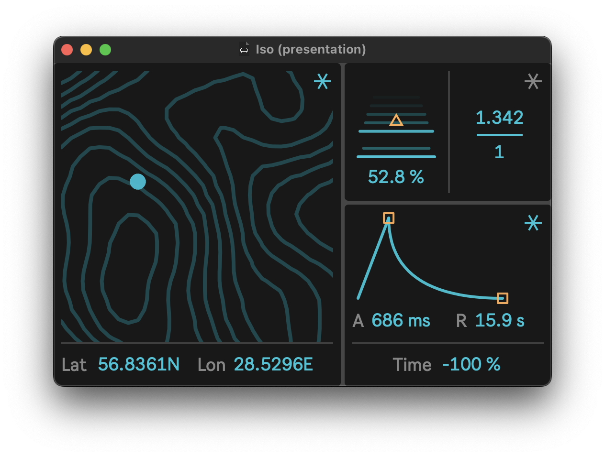

# Iso

Macro-synthesizer for Ableton Live 12.



## Setup

```shell
git clone --recursive https://github.com/pema4/lerp-iso
```

Additionally you can install dev tooling:
```shell
git config --local diff.maxpat.textconv "python3 maxdevtools/maxdiff/maxpat_textconv.py"
git config --local diff.amxd.textconv "python3 maxdevtools/maxdiff/amxd_textconv.py"
git config --local diff.amxd.binary true
git config --local diff.als.textconv "python3 maxdevtools/maxdiff/als_textconv.py"
git config --local diff.als.binary true
```

Currently, Iso requires Max 9 to run.
