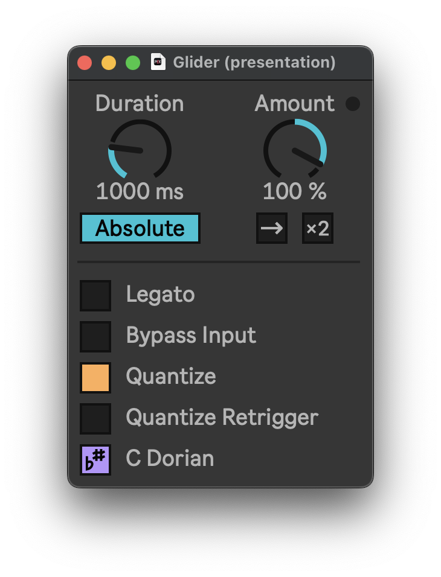

# Glider

Flexible MPE portamento effect for Ableton Live 12.



Glider generates MPE pitch-bend automations that mimic various pitch effects:
- portamento, glissando
- analog oscillator drift, extreme detuning, scale quantization, chords mutation
- arpeggios, resonators, note delays
- and much more — imagination is your limit, Glider rewards exploration and messing around.

Additionally, you can chain multiple Gliders together for infinitely complex effects and interactions.

## Setup

```shell
git clone --recursive https://github.com/pema4/lerpmusic-glider
```

Additionally you can install dev tooling:
```shell
git config --local diff.maxpat.textconv "python3 maxdevtools/maxdiff/maxpat_textconv.py"
git config --local diff.amxd.textconv "python3 maxdevtools/maxdiff/amxd_textconv.py"
git config --local diff.amxd.binary true
git config --local diff.als.textconv "python3 maxdevtools/maxdiff/als_textconv.py"
git config --local diff.als.binary true
```

Currently, Glider requires Max 9 to run.


## Architecture

There are 15 per-voice pitch-bend envelopes and one global envelope.

The global envelope follows the pitch of the last pressed note (incoming note-on messages form a stack). The target of this envelope is updated on every note-on and note-off MIDI message.

Each per-voice envelope starts when the device receives a note-on message. This envelope begins from the pitch value of the global envelope and converges to zero over a specified duration.


## Routing

Glider can process incoming pitch-bend in two different ways.
By default (with 'Bypass Input' disabled) — Glider processes incoming pitch-bend, and accounts for the initial pitch-bend offset in the global envelope. This mode is analogous to *sequential* processing.
With 'Bypass Input' enabled, Glider outputs incoming pitch-bend as-is, with generated glide effect added on top. This mode is analogous to *parallel* processing.

Both modes are useful for different effects. In particular, with 'Bypass Input' disabled (default) you can:
- quantize incoming pitch-bend
- slighly detune the notes generated by another Glider instance with 'Quantize Retrigger' enabled
- create N-note delays by chaining N Glider instances with 'Reverse' mode enabled

And with 'Bypass Input' enabled you can:
- approximate exponential curves by chaining multiple Gliders together
- add attack section to the glide — this generates Hoover-like pitch-bend
- add/substract quantized gliders — this often results in out-of-tune notes, but why not


## Implementation Notes

Glider is designed for combining and chaining. In this case, a naive implementation using the standard `line` object results in O(N^2) time complexity (where N is the number of chained Glider devices). To overcome this, we implemented a custom demand-rate variant of the line object. When the rate of incoming pitch-bend messages is high enough, the internal metronome turns off.

Processing is synchronous: glide is computed and emitted in the same event as the incoming MIDI message (note on/off and pitch-bend). Theoretically, this means that the generated pitch-bend is consistent even for short notes.

But additional MIDI messages are generated by the internal metronome, and may suffer from timing problems inherent to Max scheduler. This MIDI jitter is barely hearable, unless 'Quantize Retrigger' is enabled — in that case generated notes may have (barely noticeable) length variations.
